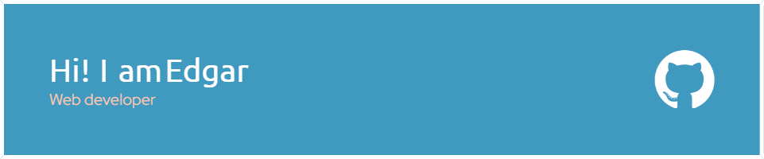

### Мои проекты: 
- [Tasker - менеджер задач](https://github.com/edgar-ianke/pet-proj-task-manager) - TS, Scss, React, React DnD, Redux ToolKit
- [Mesto - сервис для обмена и оценки фотографий](https://github.com/edgar-ianke/mesto-project) - HTML, CSS, Vanilla JS, OOP
- [Бэкэнд проекта Mesto](https://github.com/edgar-ianke/mesto-project-plus) - Express, MongoDB
- [Бэкэнд сервиса вишлистов КупиПодариДай](https://github.com/edgar-ianke/kupipodariday-backend) - NestJS, PostgreSQL
- [Stellar burgers - космическая закусочная с авторизацией и возможностью оформления заказа](https://github.com/edgar-ianke/react-stellar-burger) - TS, CSS, React, Redux, WebSocket
- [Algososh - визуализатор алгоритмов](https://github.com/edgar-ianke/algososh) - TS, CSS, React
- [Докеризация проекта КупиПодариДай](https://github.com/edgar-ianke/web-plus-docker-and-compose) - Docker, Docker-compose, Nginx, PM2
### Мои навыки:

## CodeWars Profile:

### Контакты

